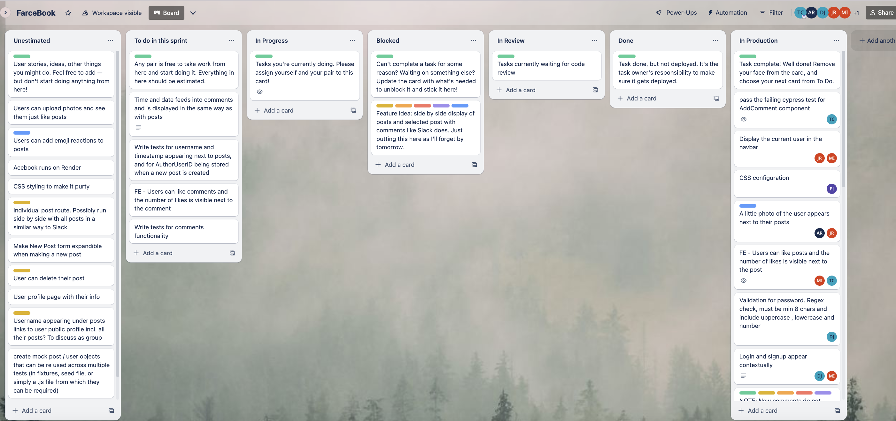

# Makers Academy Acebook test (AKA Farcebook)

## The Brief

The second of our team Engineering Projects as part of the Makers Academy software development bootcamp, over two weeks our team of 5 was tasked with understanding a [pre existing codebase](https://github.com/makersacademy/acebook-mern-template), using the MERN stack. MongoDB, React, Express and Cypress were all brand new technologies to us at the start of this project, and much of the time and energy over the two weeks went into learning these, and how they had been put into practice in the existing codebase.

From the Makers Academy brief:

>In this project, you are tasked with working on an existing application. A significant part of the challenge will be to familiarise yourself with the codebase you've inherited, as you work to **improve and extend** it.

## Architecture

This application is comprised of two distinct pieces.

- A backend API built with Express
- A front end built with React

The React front end sends HTTP requests to the backend API and receives JSON in response body, rather than a whole page of HTML.

Currently, user password are stored in the DB in plaintext. In a real world implementation of this application, we would of course have used a hashing alogirithm for this (a ticket we did not get time to implement during the project).

## Authentication

The application uses JSON Web Tokens for authentication.

Here, we've used an environment variable called `JWT_SECRET`, which you'll see used in the commands to start the application and run the tests (below). You can change the value of that environment variable to anything you like.

## Card wall

Our team trello board shows the tickets we worked through, and what was still in our backlog at the end of the final sprint.


|Team trello board 2|Team trello board 3|
|:-:|:-:|
|||


## Quickstart

### Install Node.js

1. Install Node Version Manager (NVM)
   ```
   brew install nvm
   ```
   Then follow the instructions to update your `~/.bash_profile`.
2. Open a new terminal
3. Install the latest version of [Node.js](https://nodejs.org/en/), currently `18.1.0`.
   ```
   nvm install 18
   ```

### Set up your project

1. `git clone https://github.com/tomcarmichael/acebook-mern-water-team.git`
2. 
   ```
   ; cd api
   ; npm install
   ; cd ../frontend
   ; npm install
   ```
3. Install MongoDB
   ```
   brew tap mongodb/brew
   brew install mongodb-community@5.0
   ```
   *Note:* If you see a message that says `If you need to have mongodb-community@5.0 first in your PATH, run:`, follow the instruction. Restart your terminal after this.
4. Start MongoDB
   ```
   brew services start mongodb-community@5.0
   ```

### Start

1. Start the server

  **Note the use of an environment variable for the JWT secret**

   ```
   ; cd api
   ; JWT_SECRET=SUPER_SECRET npm start
   ```
2. Start the front end

  In a new terminal session...

  ```
  ; cd frontend
  ; npm start
  ```

You should now be able to open your browser and go to `http://localhost:3000/signup` to create a new user, optionally uploading an avatar image.

Then, after signing up, you should be able to log in by going to `http://localhost:3000/login`.

After logging in, you'll be able to create posts, like and comment.

### Testing

#### The Backend (API)

**Note the use of an environment variable for the JWT secret**

  Start the server in test mode (so that it connects to the test DB)

  ```
  ; cd api
  ; JWT_SECRET=SUPER_SECRET npm run start:test
  ```

  Then run the tests in a new terminal session

  ```
  ; cd api
  ; JWT_SECRET=SUPER_SECRET npm run test
  ```

#### The frontend (React)

**Note the use of an environment variable for the JWT secret**

  Start the server in test mode **as per above**

  Set the environment variable that allows Cypress to conect to your MongoDB instance running locally by copying the address of the server on which MongoDB is running e.g. 'mongodb://localhost:27017', and running the command `export MONGO_URI=[your_mongoDB_server_address]` (without the square brackets)

  Then start the front end in a new terminal session

  ```
  ; cd frontend
  ; JWT_SECRET=SUPER_SECRET npm start
  ```

  Then, to run all Cypress tests in a new terminal session

  ```
  ; cd frontend
  ; JWT_SECRET=SUPER_SECRET npm run test
  ```

  To run only the Cypress component tests

  ```
  ; cd frontend
  ; JWT_SECRET=SUPER_SECRET npm run test:unit
  ```

    To run only the Cypress end to end tests

  ```
  ; cd frontend
  ; JWT_SECRET=SUPER_SECRET npm run test:feature
  ```


